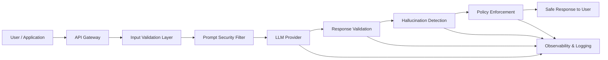
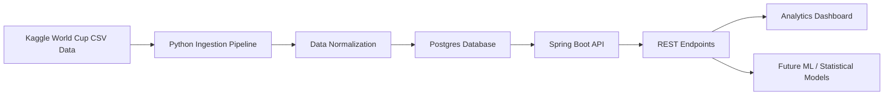
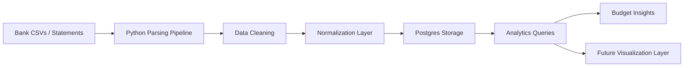

# 👋 Hi, I’m Abraham (sonOfDocker)

Senior Software Engineer focused on **distributed systems, data platforms, and AI-enabled applications**.

My background is primarily **Java + Spring Boot backend engineering**, with additional experience building **full-stack platforms, data pipelines, and cloud infrastructure**. Recently I've been expanding into **AI system architecture and guardrails** to ensure modern AI systems are **reliable, safe, and production-ready**.

I enjoy building systems where **data, APIs, and real-world user experiences intersect**.

---

# 🧠 What I’m building right now

## 🛡️ AI Guardrails Portfolio Project

A platform architecture project exploring **how to safely deploy AI systems and agents in production environments**.

Modern AI applications introduce risks such as:

- hallucinated outputs
- prompt injection
- unsafe or malicious inputs
- unverified responses

This project focuses on **building guardrail layers around LLM-driven systems**.

### Core Concepts

- input validation & prompt filtering  
- hallucination detection  
- response verification pipelines  
- safe tool invocation  
- agent runtime controls  
- observability for AI decisions  

🔗 Repo  
https://github.com/sonOfDocker/ai-guardrails-portfolio

---

## 🏆 World Cup Stats – Sports Data Platform

A full-stack analytics platform built around historical **FIFA World Cup datasets**.

The project explores how to design **clean APIs, data models, and analytics endpoints** around a real-world dataset used by fans, journalists, and analysts.

### Architecture

- Java **Spring Boot API**
- Python **data ingestion pipeline**
- Kaggle **historical World Cup dataset**
- Dockerized local environment
- REST endpoints powering future analytics dashboards

### Goals

- transform raw datasets into **normalized domain models**
- build **analytics-focused APIs**
- demonstrate **test-driven system design**
- support future **sports analytics dashboards**

🔗 Repo  
https://github.com/sonOfDocker/worldcup-stats

---

## 🚀 Pegasus Finance & Data Pipeline

A **privacy-first personal finance data platform** designed to transform messy real-world data (CSV statements, reports, exports) into structured insights.

Pegasus focuses on **data ingestion, normalization, and analytics pipelines**.

### Highlights

- Python ingestion & transformation pipelines
- Dockerized Postgres data store
- schema design for evolving financial datasets
- local-first architecture for privacy

🔗 Repo  
https://github.com/sonOfDocker/pegasus_tracker

---

# 🏗️ Featured Architecture Projects

Below are simplified architecture views of the systems I'm currently building.

These projects focus on **data pipelines, platform APIs, and responsible AI system design**.

---

## 🛡️ AI Guardrails Platform Architecture

### Design Focus

- AI safety guardrails  
- prompt injection protection  
- hallucination mitigation  
- response verification  
- safe tool execution  
- AI observability  

Repo  
https://github.com/sonOfDocker/ai-guardrails-portfolio

---

## 🏆 World Cup Stats – Data Platform

### Design Focus

- converting raw datasets into domain models  
- clean REST API design  
- test-driven backend development  
- analytics-ready architecture  

Repo  
https://github.com/sonOfDocker/worldcup-stats

---

## 🚀 Pegasus Finance Data Pipeline

### Design Focus

- messy real-world data ingestion  
- schema evolution  
- privacy-first architecture  
- extensible data modeling  

Repo  
https://github.com/sonOfDocker/pegasus_tracker

---

# 🛠️ Technologies I Work With

## Backend

- **Java (Spring Boot)**
- REST API design
- distributed systems patterns
- Python for ingestion & analytics

## Frontend

- JavaScript / TypeScript
- React
- dashboard & analytics interfaces

## Infrastructure

- AWS
- Docker & Docker Compose
- Terraform
- GitHub Actions

## Data Engineering

- data pipeline design
- schema evolution
- analytics-oriented modeling
- CSV & structured dataset ingestion

---

# 🎯 Areas of Interest

- AI platform architecture
- AI guardrails & safe AI deployment
- distributed systems
- data pipelines & analytics platforms
- sports analytics
- consumer-facing platforms powered by data

---

# 🧩 Engineering Principles

- design systems around **clear data models**
- build **observable and testable platforms**
- favor **explicit contracts over hidden assumptions**
- use **test-driven development** to guide architecture
- treat side projects with **production-level discipline**

---

# 📫 Connect

GitHub  
https://github.com/sonOfDocker

